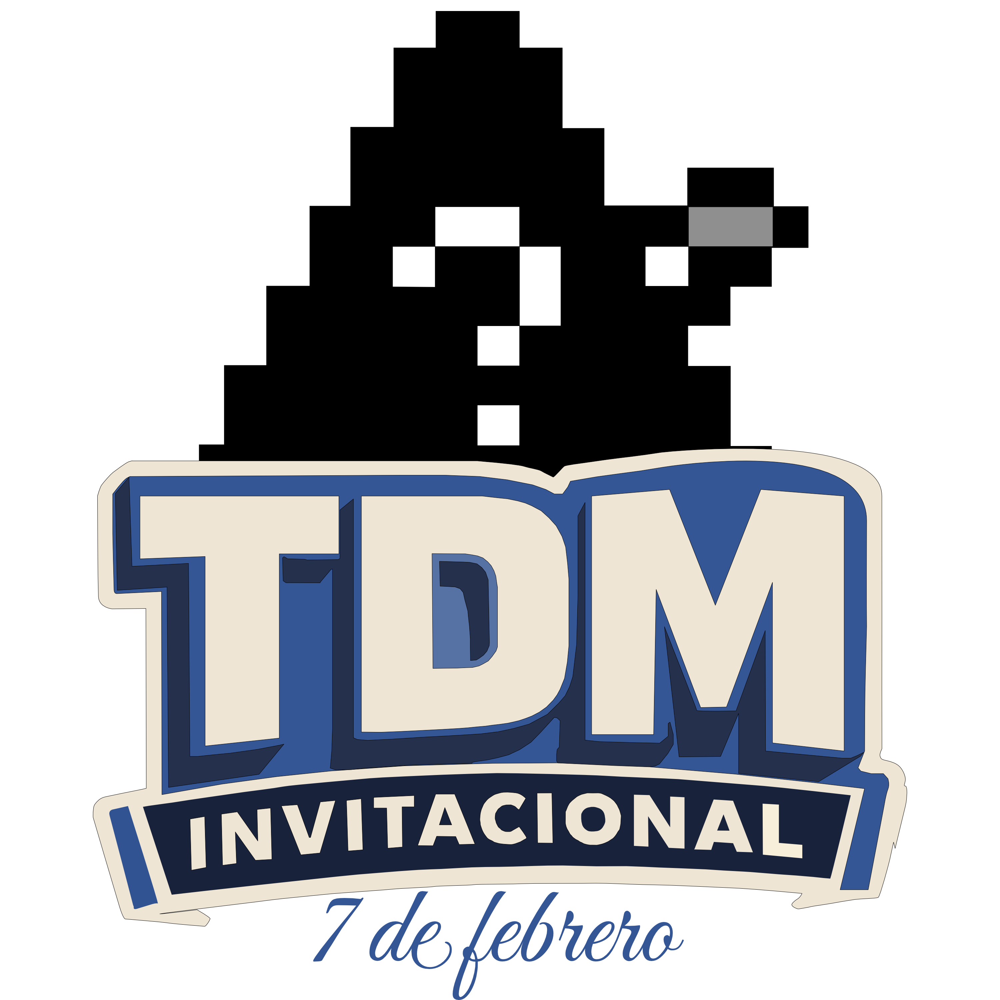
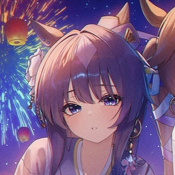

<div align="center">
  
  
  # Torre del Mago Invitacional
  
  ### Torneo Invitacional 1v1
  
  [](https://codecambing.github.io/TDM-webpage/)
  [](https://osu.ppy.sh/)
  
</div>

---

## 🎮 Sobre el Torneo

Torre del Mago Invitacional es un torneo 1v1 de varios juegos diseñado por un grupo de amigos.

### Características

- 🏆 **Formato:** Eliminación directa 1v1
- 👥 **16 jugadores:** Miembros del team Torre del Mago en osu!
- 🎯 **ScoreV2** en las matches de osu!
- 🕹️ **Juegos** cuidadosamente seleccionados
- 💰 **Premios** por anunciar

---

## 👨‍💼 Staff del Torneo

<table align="center">
  <tr>
    <td align="center" width="200">
      <br />
      <sub><b>Blackmoderm10</b></sub><br />
      <sub>🎤 Host</sub>
    </td>
    <td align="center" width="200">
      <br />
      <sub><b>Touche</b></sub><br />
      <sub>🎤 Host</sub>
    </td>
        <td align="center" width="200">
      <br />
      <sub><b>Lasseh</b></sub><br />
      <sub>🏠 Host lugar</sub>
    </td>
    <td align="center" width="200">
      <br />
      <sub><b>Intercambing</b></sub><br />
      <sub>⚙️ Desarrollador página</sub>
    </td>
  </tr>
</table>

## 🔗 Enlaces Importantes

<div align="center">

[](https://codecambing.github.io/TDM-webpage/)
[](https://twitter.com/TDMInvitational)

</div>

---

## 💻 Tecnologías Utilizadas

- **[Astro](https://astro.build/)** - Framework web
- **[Tailwind CSS](https://tailwindcss.com/)** - Estilos
- **[osu! API v2](https://osu.ppy.sh/docs/)** - Datos de jugadores
- **GitHub Pages** - Hosting

```